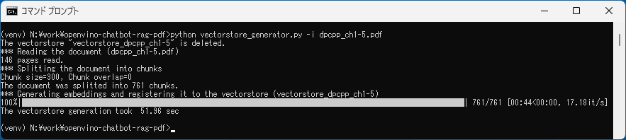
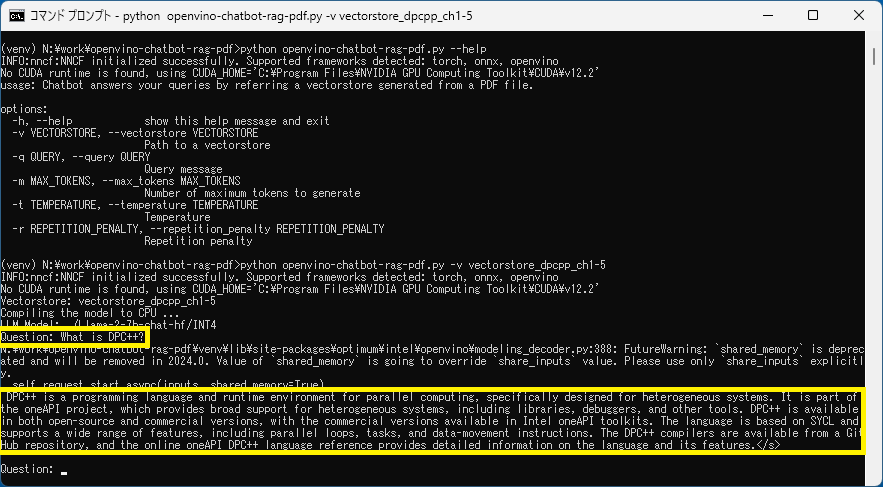
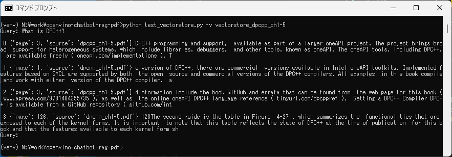

# OpenVINO Chatbot using RAG (PDF)

## Description
This project demonstrates how to extend the LLM models' capability to answer a question related to a given document.
The project consists of two programs. One is for preparation, and the other is for question and answering using LLM.
The preparation program will read a PDF file and generate a database (vector store).
The LLM model will pick up a collection of a fraction of the input document that is related to the given query from the user and then answer the query by referring to the picked-up documents. This technique is so called RAG (Retrieval Augmented Generation).

## Programs/Files
|#|file name|description|
|---|---|---|
|1|`vectorstore_generator.py`|Reads a PDF file and generates a vectorstore.|
|2|`openvino-chatbot-rag-pdf.py`|LLM chatbot using OpenVINO. Answer to the query by refeering a vectorstore.|
|3|`llm-model-downloader.py`|Downloads LLM models from HuggingFace and converts them into OpenVINO IR models.<br>By default, this program downloads dolly-v2-3b, neural-chat-7b-v3-1, tinyllama-1.1b-chat-v0.6, and youri-7b-chat. You can download llama2-7b-chat by uncomment some lines in the code.|
|4|.env|Some configurations (model name, model precision, inference device, etc)|

## How to run
0. Install prerequisites
```sh
python -m venv venv
venv\Scripts\activate
python -m pip install -U pip
pip install -U setuptools wheel
pip install -r requirements.txt
```

1. Download LLM models
This program downloads the LLM models and converts them into OpenVINO IR models.
If you don't want to download many LLM models, you can comment out the models in the code to save time.
```sh
phthon llm-model-downloader.py
```

2. Preparation - Read a PDF file and generate a vectorstore
```sh
python vectorstore_generator.py -i input.pdf
```
`./vectorstore_{pdf_basename}` directory will be created. The data of the vectorstore will be stored in the directory. E.g. `./vectorstore_input`.


3. Run LLM Chatbot
```sh
python openvino-chatbot-rag-pdf.py -v vectorstore_input
```


## Appendix - vectorstore (retriever) test tool
You can check which fraction of the input documents are picked up from the vectorstore based on the input query.
```sh
python test_vectorstore.py -v vectorstore_hoge
```


## Test environment
- Windows 11
- OpenVINO 2023.2.0
